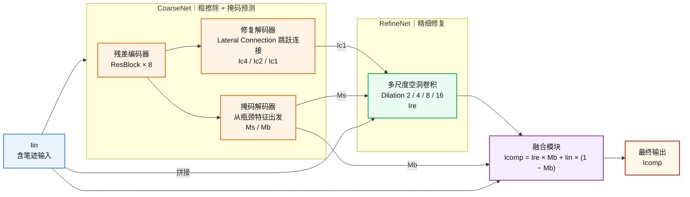

# EnsExam — 试卷文字擦除模型

基于 GAN 的试卷手写笔迹擦除模型，结合 Reptile 元学习实现跨学生笔迹风格的快速泛化。

---

## 模型架构



**判别器**：Local-Global Hinge GAN，全局判别器 + 掩码加权局部判别器。

**损失函数**：LR Loss（多尺度重建）+ 感知损失 + 风格损失 + SN Loss + Block Loss（Dice）+ GAN Hinge。

---

## 目录结构

```
models/
├── config.yaml             # 所有超参数
├── config_loader.py        # 配置加载器
├── train.py                # 微调训练入口
├── meta_train.py           # Reptile 元训练入口
├── tune.py                 # Optuna 超参数调优入口
│
├── data/
│   ├── dataset.py          # EnsExamRealDataset（滑动裁剪 + padding）
│   ├── augmentation.py     # Paired 数据增强（albumentations）
│   └── mask_utils.py       # 软笔画掩码 / 文本块掩码生成（SAF 算法）
│
├── networks/
│   ├── blocks.py           # CBAM、DownSample、UpSample、DilatedConvBlock 等基础块
│   ├── generator.py        # CoarseNet / RefineNet / Generator
│   └── discriminator.py    # Local-Global Discriminator
│
├── losses/
│   └── losses.py           # VGG16Feature、gram_matrix、EnsExamLoss
│
└── tools/
    ├── reptile.py          # ReptileMetaLearner
    ├── early_stopping.py   # 早停
    ├── analyze_dataset.py  # 数据集统计
    └── test_gpu.py         # GPU 环境检测
```

---

## 环境要求

| 组件 | 版本 |
|------|------|
| Python | 3.7+ |
| PyTorch | 1.13+ |
| CUDA | 11.7+（推荐）|
| GPU 显存 | ≥ 8 GB |

### 安装依赖

```bash
# PyTorch（CUDA 11.7）
pip install torch==1.13.1+cu117 torchvision==0.14.1+cu117 \
    --index-url https://download.pytorch.org/whl/cu117

# 其余依赖
pip install opencv-python Pillow numpy albumentations tqdm \
    optuna optuna-dashboard wandb PyYAML

# 或直接使用 requirements.txt
pip install -r requirements.txt
```

---

## 数据集

使用 [SCUT-EnsExam](https://github.com/HCIILAB/SCUT-EnsExam) 数据集，目录结构：

```
data_root/
├── train/
│   ├── all_images/      # 带笔记的原始试卷
│   ├── all_labels/      # 擦除后的干净底图（同名文件）
│   └── box_label_txt/   # 文本块四边形标注（同名 .txt，用于精确 Mb）
└── test/
    ├── all_images/
    ├── all_labels/
    └── box_label_txt/
```

在 `config.yaml` 中设置路径：

```yaml
data:
  data_root: /path/to/SCUT-EnsExam
```

---

## 训练流程

### 第 0 步：验证 GPU 环境

```bash
python tools/test_gpu.py
```

### 第 1 步：Reptile 元训练

在所有学生笔迹风格上学习泛化初始参数，约需数小时。

```bash
python meta_train.py
# 输出：reptile_checkpoints/reptile_meta_init.pth
```

### 第 2 步：超参数调优（可选）

在元初始化基础上用 Optuna 搜索最优微调超参数，每个 trial 只跑 5 epoch。

```bash
# 启动调优（50 个 trial）
python tune.py

# 实时监控，另开终端
optuna-dashboard sqlite:///tuning.db
# 浏览器打开 http://127.0.0.1:8080

# 中断后续调
python tune.py --resume
```

调优结束后将最优参数填回 `config.yaml`。

### 第 3 步：微调训练

修改 `config.yaml`：

```yaml
train:
  resume: true
  resume_path: ./reptile_checkpoints/reptile_meta_init.pth
```

```bash
python train.py

# 指定配置文件
python train.py --config my_config.yaml
```

**训练产物：**

| 文件 | 说明 |
|------|------|
| `ensexam_checkpoints/best.pth` | 验证集 loss 最优权重 |
| `ensexam_checkpoints/latest.pth` | 最新权重（断点续训）|
| `ensexam_checkpoints/epoch_N.pth` | 定期快照 |
| `logs/train_YYYYMMDD.log` | 完整文本日志 |
| `logs/loss_history.csv` | 每 epoch 损失，可直接用 pandas 绘图 |

---

## W&B 监控

```bash
wandb login      # 首次登录
python train.py  # config.yaml 中 wandb.enabled=true 时自动上传
```

面板内容：训练/验证 Loss 曲线、GPU 利用率、每 N epoch 的擦除对比图。

---

## config.yaml 配置项速览

| 节 | 主要参数 |
|----|---------|
| `model` | 网络通道数、CBAM 压缩比 |
| `loss` | LR / 感知 / 风格 / SN / Block 损失权重 |
| `train` | epochs、lr、batch_size、Adam betas、断点续训 |
| `data` | 数据集路径、裁剪尺寸、掩码阈值、数据增强概率 |
| `early_stopping` | patience、min_delta |
| `reptile` | meta_epochs、inner_lr、meta_lr、n_tasks_per_episode |
| `tuning` | Optuna 搜索空间、trial 数、SQLite 路径 |
| `wandb` | 项目名、run 名、图片上传频率 |
| `logging` | 日志目录 |

---

## 致谢

### 模型原始作者

本模块的核心模型代码（网络结构、损失函数、训练流程）由 **ADchampion3**在 [xiaozhejiya/error_correction](https://github.com/xiaozhejiya/error_correction) 仓库的 `feature/classify_model` 分支上完成，主要贡献包括：

- 上传模型初步代码（commit `6010999`）
- 修改模型结构（commit `831b752`）
- 移除 `Mb_UpSampleBlock`（commit `b5729a0`）
- 修改 soft mask 实现（commit `2a87b8c`）

本仓库在上述工作的基础上，补充了数据集加载、数据增强、训练日志、早停、W&B 监控、Reptile 元训练以及 Optuna 超参数调优等工程化模块，并将原始分支独立为单独仓库。

> 原始分支地址：
> https://github.com/xiaozhejiya/error_correction/tree/feature/classify_model

### 数据集

数据集来自华南理工大学人机交互研究室（SCUT-HCCLab）：

> Lianwen Jin et al., "SCUT-EnsExam: A Benchmark Dataset for Handwritten Text Erasure on Examination Papers," *Pattern Recognition*, 2022.
> [[GitHub]]([https://github.com/HCIILAB/SCUT-EnsExam](https://github.com/SCUT-DLVCLab/SCUT-EnsExam))]([https://github.com/HCIILAB/SCUT-EnsExam](https://github.com/SCUT-DLVCLab/SCUT-EnsExam))
